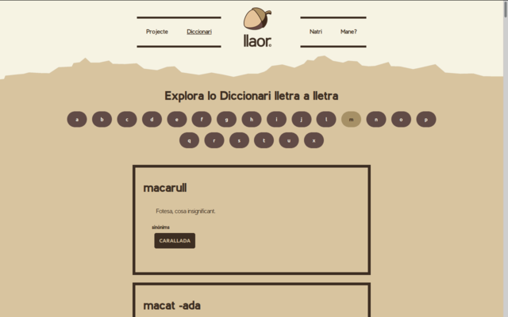

# Llaor web

This project aims to store information about Pallars culture and language.
You can visit it online [here](https://llaor.com)

For the moment is composed by a welcome page, which has only one seccion: a dictionary.
Dictionary is composed by a set of words
that can be visualized by a first letter menu or searching by text.
Users can also navigate between words that are synonmis or related,
improving their discoverability.



## Documentation

This site has two menu pages: `/` is the welcome page with a button to `/diccionari`,
a section that leads to `/diccionari/cerca` (search page) and `/diccionari/lletres` (abc list).
`/diccionari/cerca/<text>` is also a valid url to search for <text>.
`/diccionari/lletres/o` will show the user all the words beggining with 'o'.
`/diccionari/mots/<example>` prints the definitions of the word 'example'.

Technically, this web project is very easy. It uses plain react,
fetching the data from the [llaor-api](https://github.com/jordifierro/llaor-api).

Styles are compatible with computer and mobile.

## Setup

* Create `.env` file and add:
```bash
NODE_PATH=src
REACT_APP_API_HOST=llaorapihost.com
```
* Run `docker build -t llaor/web`
* Then `docker run -t llaor/web bash -c "npm run test"` will run tests
* And `docker run -p 3000:3000 -t llaor/web` will make web locally available at `localhost:3000`
